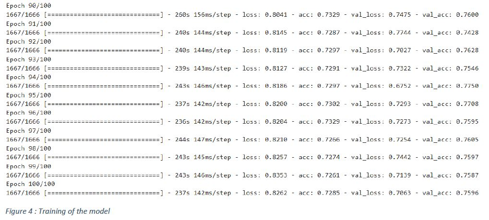

Described below are discussion and steps that I did to train and evaluate the performance of my CNN model.

<h3>Dataset:</h3> The dataset I have used for this assignment is CIFAR10 (Krizhevsky, 2009). The CIFAR10 dataset consists of 60,000 tiny 32*32*3 color images. The images are of 10 classes – 'airplane', 'automobile', 'bird', 'cat', 'deer', 'dog', 'frog', 'horse', 'ship', 'truck'. I divided the dataset into training set consisting of 50,000 images and test set consisting of 10,000 Images. The training dataset was perfectly balance with each class having 5000 images, as can be seen from the fig.1 below.

<h3>Pre-processing:</h3> The images in the dataset that were going to be used for training the CNN for the purpose of classification could not be used as it is. Following are the pre-processing steps that I followed

<h5>Normalization:</h5> In image data, all values range from 0 to 255. Thus when it is passed to a squashing function like Rectified Linear unit(ReLu), the output will be large which will result in a exploding grading problem during back-propagation process. To avoid this, I have performed normalization on the image data. The data is normalized and transformed in range of 0 and 1.
<h5>One-hot Encoding:</h5> As the dataset is divided into 10 different classes of image, I have made a vector of size 10 as well, where each value represents the prediction probability of each class. The label data is also transformed into a similar type of vector of the same size. The ground truth is set to 1 for that corresponding class.

E.g. for cat -> [0, 0, 0, 1, 0, 0, 0, 0, 0, 0]

<h3>CNN Model</h3>

I have used the sequential method of Keras to create the model layer by layer. A short description of all the layer shown in the model summary in fig. 3 .

Conv2d is a 2 dimensional convolutional layer. I have used 32 filters of size 3*3 in this layer. It takes an input of 32*32*3 size image and gives a feature map as an output.

Dropout layer does the job of dropping random set of activation in the layer by setting them to zero. This is done to prevents the problem of overfitting.

MaxPooling layer is used to reduce the dimension of the feature. This is done without losing any important information from the feature map.

Flatten is used to convert the feature map to 1 dimension. The value passed is 2.

For the squashing function, I have used ReLu and softmax.

<h3>Hyperparameters:</h3>
Epochs : 100

Learning Rate : 0.01

Batch size : 32

Decay = Learning rate / Epochs

Optimizer = RMSprop

The prediction Accuracy(discussed below) of the model was good with the hyperparameters used. Change in learning rate or any other parameter did not improve the performance of the model in any significant manner. Thus the parameter were not subject to adjustment and are not discussed in detail.

<h3>Training and Result</h3>
After Making and compiling the model , I started with training my model on the dataset. The training on an average took me 7-8 hrs for 100 epochs. Fig. 4 shows the training of my model for 100 Epochs.

After the model has been trained , I executed it on the testing data to see it accuracy.

As can be seen from the above figure , the model gave me an accuracy of 75%.
The graph below shows the cost of train vs tests that I obtained while training and testing the model.

As can be seen from fig. 5, cost decreased with the Epochs.
The graph below shows the Accuracy of Train vs Test data. As can be seen from fig. 6, the accuracy of model increases steadily with the increase in Epochs.

After this, I selected a group of 9 images from the testing data to predict the label of the images. As can be seen from fig.7, the model successfully predicted 8 out of 9 images with an accuracy of about 89% for this small batch. The only wrong prediction was of the automobile which was predicted as truck.

